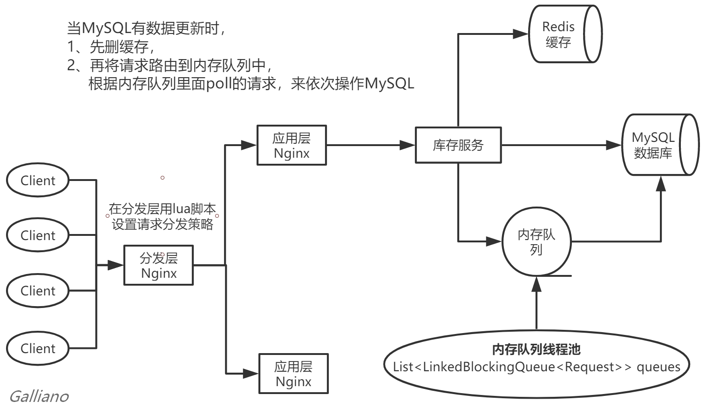
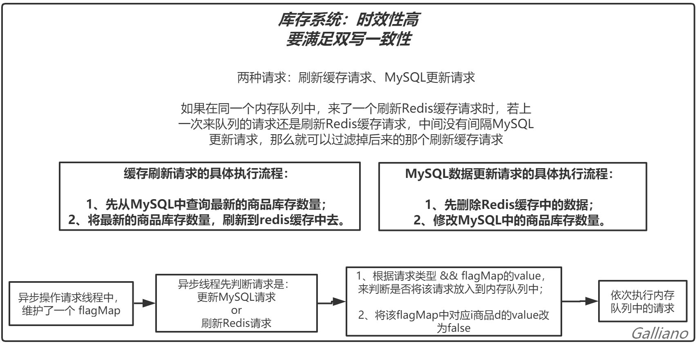
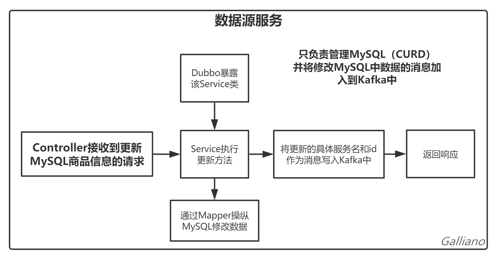
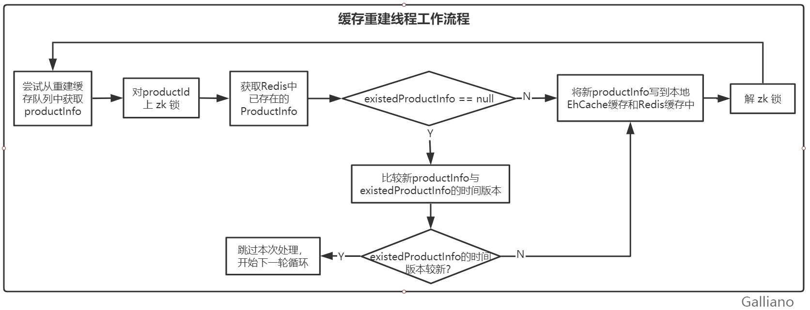

#### 目录

一、项目简介
- 三级缓存架构
- “分发层 应用层” 双层 Nginx 架构

二、项目整体架构
- 详情页系统整体架构图

三、项目结构

四、项目工作流程分析
- 1、库存服务
	- 库存系统架构图
	- 库存系统简要介绍图
	- 库存系统具体工作流程图
- 2、数据源服务
	- 数据源服务工作流程图
- 3、缓存服务
- 4、热点计算服务

五、项目解决的关键问题
- 1、解决了 MySQL 和 Redis 的双写最终一致性问题
	- 1.1 问题描述
	- 1.2 问题解决
	- 1.3 更新的时候，为什么要删除缓存，而不是更新缓存？
- 2、使用 ZooKeeper 实现分布式锁，解决分布式缓存重建并发冲突问题
	- 2.1 问题描述
		- 图示缓存重建并发冲突问题
	- 2.2 问题解决
		- 缓存重建线程工作流程图
- 3、通过缓存预热，解决 Redis 冷启动问题
	- 为什么要防止冷启动？
	- 缓存预热流程图
	- 3.1 使用 Storm 完成实时热数据统计
	- 3.2 使用 zk 分布式锁完成并行缓存预热
- 4、解决热点缓存自动降级与恢复
	- 4.1 问题描述
	- 4.2 问题解决
- 5、使用 Hystrix 解决缓存雪崩
	- 5.1 先解决缓存失效
	- 5.2 缓存雪崩的后果
	- 5.3 问题解决
- 6、解决高并发下的缓存穿透

---

---

---

# 商品详情页系统 - lvshop

## 0 、前言

​		最初看到很多简单的 Demo 都是将服务直接访问MySQL，不管是读取数据还是变更数据，都是走MySQL，由于MySQL的并发承受能力并不强，导致性能十分低下。

​		后来在扩展知识面的时候，发现用缓存可以极大的提升并发性能，一个合格的购物系统一定要使用缓存，此时就开始思考做一个带缓存的购物系统。

​		起初觉得在 MySQL 层上面铺一层 Redis，好像很容易理解，看起来实现也并不困难，但是真正实现 code 的时候，遇到了很多困难，然后查询博客，发现缓存系统中其实蕴含了很多问题，需要一一来解决。

​		自己做的一个简易系统不过是一个小玩具罢了，里面隐藏了很多问题待解决，也有很多细节还可以继续优化，但是可以作为一个良好的起步，为后面学习更多的知识打下坚实的基础。

​		万丈高楼平地起。我们每学习一个新知识点，都会在未来帮助我们更容易地去理解新知识。只有我们夯实基础，孜孜不倦地拥抱技术，技术才会给我们最真实的回馈。

## 一、项目简介

在高并发场景下，大量客户端请求同时发送到服务端，普通的商品详情页系统很可能因承受不了太大并发而导致数据库崩溃，进而导致整个系统崩溃。

该项目作为简化的商品详情页系统，实现了底层的缓存架构，并解决了部分**缓存、高并发、可用性**等相关问题。

本项目在高并发场景的视角下，**根据不同类型数据信息的时效性区别**，采用不同的解决方案：

- 对于**时效性要求高**的数据：
  - 这些数据种类较少，例如：商品库存数据等；
  - **解决措施**：相关库存数据每次发生变更时，直接采取 **MySQL 和 Redis 双写**的方案，保证了MySQL 和 Redis 的**一致性**，并实现了一个**内存队列线程池**，并实现了针对同一数据 id 的**请求过滤**功能，保证缓存的时效性最高。

- 对于**时效性要求不高**的数据：
  - 这些数据种类繁多，且来自多种不同的系统，例如：商品信息数据、店铺信息数据等；
  - **解决措施**：
    - 采用**三级缓存架构：**
      - **Nginx本地缓存+ EhCache + Redis分布式缓存 **；
    - 采取 **Kafka 异步通知**：
      - 缓存服务**监听 Kafka**。然后数据源服务发生了数据变更之后，就将数据变更的消息发送到 Kafka 中；
      - 缓存服务从 Kafka 中消费到数据变更的消息，根据消息内容提取一些参数（数据id等），然后**远程调用对应数据源服务**的接口查询 MySQL 中的数据，使用该数据来**更新EhCache缓存和 Redis 缓存**。

#### 三级缓存架构：

**获取缓存的流程简述**：`Nginx本地缓存 ==> 缓存服务 ==> Ehcache ==> Redis`。

**每一层的作用**：

- **Nginx 本地缓存**：应对**热数据的高并发访问**，以最短的时间向用户返回数据。
- **EhCache 缓存**：直接调用服务本地存储的缓存，减少远程查询Redis缓存的请求量。
- **Redis 分布式缓存**：应对**海量普通数据的高并发访问**，并且利用分布式集群做到高可用。

如果数据在三级缓存中都找不到了，很可能就是被 LRU 清理掉了。这个时候缓存服务会重新拉取数据，然后更新到 Ehcache 和 Redis中。此处会产生**分布式缓存重建的并发问题**。

#### “分发层+应用层” 双层 Nginx 架构

**单层 Nginx 的缓存命中率非常低**：

- 当外来请求打到一个 Nginx 时，都会查看该 Nginx 缓存有没有数据，若没有则再访问 Redis 来返回数据，同时将数据存到 Nginx 缓存中。

- 根据负载均衡，一般对同一个数据的多个请求很可能被均衡到不同的Nginx服务器上：
  - 若每个 Nginx 都存储自己的一部分缓存，则会导致缓存命中率低；
  - 若每个 Nginx 都同步共享缓存，则会产生大量重复缓存，造成缓存空间浪费。

**双层 Nginx 提升缓存命中率**：

- 分发层 Nginx：负责以某负载均衡策略，将对同一个数据的多个请求都分发到同一个应用层 Nginx上。
- 应用层 Nginx：负责将流量分发到具体的服务中。
  - **自定义流量分发策略**：比如对 productId 进行 hash，然后对应用层 Nginx 数量进行取模。使某一个商品的访问的请求，固定路由到同一个后端服务器上去，保证只有第一次请求时从redis中获取一次缓存数据，后面全都是走nginx本地缓存了。
  - 可以大幅度减少 Redis 的压力，提升性能。

**优点**：

- 每个应用层 Nginx上都存储不同数据的缓存，保证每个应用层 Nginx上的本地缓存能物尽其用，并且**提升了缓存命中率**。

---

## 二、项目整体架构

##### 详情页系统整体架构图：

---

## 三、项目结构

该项目有2个子系统，分别为：商品库存系统、商品及店铺基本信息系统

- 商品库存系统：完成对商品库存信息的所有操作；

- 商品及店铺基本信息系统包含3个服务：数据源服务、缓存服务和实时计算服务，合力完成对商品基本信息和店铺基本信息的所有操作。

---

## 四、项目工作流程分析

以各个服务为单位进行分析：

### 1、库存服务

库存服务专门针对商品库存这一时效性要求非常高的数据，在库存每次发生变更时，直接采取**MySQl 和 Redis 双写**的方案，保证缓存的高时效性。

##### 库存系统架构图：

##### 库存系统简要介绍图：

##### 库存系统具体工作流程图：

---

### 2、数据源服务

- 连接 MySQL，对商品信息和店铺信息进行增删改查；
- 利用 Sharding-JDBC 完成了对 MySQL 的**主从复制、读写分离**；
- 当数据源服务有对 MySQL 的数据变更操作时，会**往 Kafka 中发送消息**，缓存服务订阅 Kafka 中的消息。
  - 其中消息包含3个字段：serviceId、productId、shopId；
  - 根据serviceId确定该数据变更来自商品信息还是店铺信息；
  - 当为商品信息时，将不写shopId字段。当为店铺信息时，同理；

##### 数据源服务工作流程图：

---

### 3、缓存服务

1. 监听 Kafka Topic，接受来自数据源服务的消息；
2. 如果数据源服务发生了数据变更，就会发送变更数据的消息到 Kafka Topic 中；
3. 缓存服务监听到了消息以后，就远程调用数据源服务中方法来查询 mysql 中数据；
4. 缓存服务拉取到了数据之后，会将数据在Ehcache本地缓存和Redis 中各写入份。

---

### 4、热点计算服务

用来**计算**一定时间内排名前N**热点数据和热数据**，为缓存预热和热点数据缓存提供数据。

- 热点数据：比访问量均值高出一定倍数的数据；
- 热数据：访问量排名靠前的数据。

---

## 五、项目解决的关键问题

### 1、解决了 MySQL 和 Redis 的双写最终一致性问题

#### 1.1 问题描述：

当MySQL中数据变更时，需要删除缓存并更新数据库，但不管是先删除缓存再更新数据库，还是先更新数据库再删除缓存，都无法满足缓存和数据库的最终一致性。

#### 1.2 问题解决：

在**先删除缓存再更新数据库**的基本前提下，增加**内存队列线程池**：

- **刷新缓存请求**（ProductInventoryCacheRefreshRequest）和**更新MySQL请求**（ProductInventoryDBUpdateRequest）都是在项目中定义的请求，在客户端读请求处理代码中生成刷新缓存请求，在客户端更新请求处理代码中生成更新数据库请求
- **hash路由**：**将同一 id 相关的请求**（刷新缓存请求或更新MySQL请求）都存入**同一个内存队列**中，然后依次取出并执行内存队列中存放的请求。
  - 根据同一个队列中请求的 **FIFO**，可以保证队列中**之前的更新MySQL请求一定比后来的刷新缓存请求先执行。**
- 此处做了**刷新缓存请求的去重优化**：
  - 如果在同一个内存队列中，来了一个刷新缓存请求时，此时根据**标志变量 flag** 判断**最近加入该队列的请求**是什么请求，若还是刷新Redis缓存请求，中间并没有间隔MySQL更新请求，那么就可以**过滤掉后来的那个刷新缓存请求**。尽量保证**减少不必要的操作**。
- 刷新缓存请求和更新数据库请求都是由执行请求的**工作线程**来**异步执行**的。

#### 1.3 更新的时候，为什么要删除缓存，而不是更新缓存？

1. 更新缓存的**代价很高**。
2. 如果有请求不断的修改某id的数据，那么这个**缓存会被频繁的更新**，但很可能这个缓存并不会被频繁访问，造成吞吐量降低。
3. 删除缓存也体现了**懒加载**思想：当真正有请求来查数据的时候，再从MySQL中查询数据存储到Redis中。

---

### 2、使用 ZooKeeper 实现分布式锁，解决分布式缓存重建并发冲突问题

从 Nginx 来的请求和 Kafka 中消费的消息，都可能会触发重建缓存：

- 应用层 Nginx 发现本地缓存中没有数据时，就采取**类似与分发层 Nginx 的 hash 分发策略**，对 productId 进行hash取模，**将同一 productId 的请求固定分发到同一个缓存服务实例中去**。避免多个缓存服务实例同时**更新**同一个缓存了。
- 数据源服务发送的**变更消息**，按照 productId 去分区，**固定的商品变更走固定的 Kafka 分区**，让固定的一个缓存服务实例获取到。

#### 2.1 问题描述：

**应用层 Nginx 的 hash分发策略与 Kafka 的分区策略很可能不一致**，导致不同缓存服务实例都在重建 Redis 的同一个key，由于网络传输有快慢，可能造成**旧数据比新数据后写入Redis**，产生**覆盖**新数据的情况。

##### 图示缓存重建并发冲突问题：

#### 2.2 问题解决：

1. 对于变更缓存重建以及空缓存请求重建任务，在更新 Redis 之前，**都要先获取对应 productId 的 zk 分布式锁**。
2. 拿到分布式锁之后，**比较时间版本**：如果自己的版本比 现在Redis 中的版本要新，那么就更新，否则就不更新。
3. 如果拿不到分布式锁，那么就每间隔一小段时间**轮询尝试**，直到拿到分布式锁。

##### 缓存重建线程工作流程图：

---

### 3、通过缓存预热，解决 Redis 冷启动问题

##### 为什么要防止冷启动？

因为 Redis 在第一次启动，或彻底崩溃后启动，若没有存储任何缓存数据，会造成MySQL压力过大，造成刚启动的系统立马崩溃。

##### 缓存预热流程图：

#### 3.1 使用 Storm 完成实时热数据统计

1、使用OpenResty (Nginx + lua) 将商品详情页访问请求对应的流量、日志，实时上报到 Kafka中。

2、Storm 消费 Kafka 中的数据，实时统计出每个商品的访问次数，访问次数的算法基于 LRU 内存数据结构的存储方案。

- 每个 Storm task 启动的时候，基于 zk 分布式锁，将自己 task id 累加写入同一个 zk 节点中，存成一个 taskidList。
  - 因为多个 task 可能并发执行，所以需要加分布式锁。
- 每个 Storm task 分别负责完成自己那部分的热数据的统计。每隔一段时间，就遍历一下这个map，维护一个前N个商品的 list，更新这个list。
- 使用一个后台线程，每隔一段时间都将排名前N的热数据 list，同步到 zk 中，存储到这个 Storm task对应的一个znode中去。

**热数据统计线程的工作流程**：

#### 3.2 使用 zk 分布式锁完成并行缓存预热

此时 Storm 的每个 task 节点分别已经完成了热数据的统计工作，将热点商品的id存成列表，存储在对应的 taskid 的 zk 节点上，用于缓存预热。

服务重新启动或第一次启动时，进行缓存预热，具体流程如下：

1. 从 zk 中读取 taskid 列表；
2. 依次遍历每个 taskid，**fastfail 尝试获取分布式锁1次**：
   - 如果获取不到锁：不要等待，直接跳过该 taskid，尝试获取下一个 taskid 的分布式锁。
     - 因为已经有其他服务实例线程在预热该 taskid 了。
   - 如果获取到了锁：
     2. 检查这个 taskid 的**预热状态值**是否被设置过，
        1. 如果被设置过，证明已经该taskId被其他线程被预热过了，就不再预热了。
           - 可以有效**避免重复预热**。
        2. 如果没有被设置过：
           1. 执行预热操作：遍历 productid 列表，从 MySQL 查询数据，然后写到 EhCache 和 Reids 中。
           2. **预热完成后，设置 taskid 对应的预热状态值为“success”**。
3. 最后释放锁。

---

### 4、使用 Storm、OpenResty 实时设置热点缓存，防止缓存击穿  

使用到的技术：Storm、ZooKeeper、OpenResty(Nginx、Lua)。

- 热点数据：比访问量均值高出阈值倍的数据。
- 热数据：访问量排名靠前的数据。

#### 4.1 问题描述：

**缓存击穿现象**：

- 对于一些设置了过期时间的 key ，如果这些 key 是一种非常 “热点” 的数据，可能会在某些时间点被超高并发地访问。
- 这些数据过期的时候，恰好对这个 key 有大量的并发请求，这些请求发现缓存缓存中无数据，就会从 MySQL 加载数据并回设到缓存。
- 此时不加锁的话，大量请求可能会瞬间把 MySQL 压垮。

**热点缓存现象**：

- 在**秒杀活动**（单点超高并发）中，某一个商品可能会在秒杀开始的1秒内被点击几十万次（这样的商品就是**热点数据**）：
  - 这些请求会被分发层 Nginx 分发到同一个应用层 Nginx 上，请求量太大导致该应用层 Nginx 崩溃，然后分发层 Nginx 接着分发到其他某个应用层 Nginx 上，又导致这个应用层 Nginx 崩溃，一连串导致所有的应用层 Nginx 都崩溃了。
  - 就算应用层 Nginx 没有崩溃，服务到 Redis实例 的请求也还是通过 Hash 分发的，Redis 也扛不住这样的并发量，导致一连串的Redis 崩溃，最终导致系统全盘崩溃。

#### 4.2 问题解决：

1. **在 Storm 中实时的算出哪些是热点数据**
   - 使用比较简单的算法：
     - 在某个 storm task上算出了1万个商品各自的访问次数，存储在 LRUMap 中。
     - 以较高频率（如：每隔30秒）**遍历LRUMap**，然后降序排序每个商品访问量，存在一个新的`List<Entry>`里面，求出访问量排后95%的商品访问量均值。
     - 然后从商品访问量最大到最小的方向**遍历**，**找出所有热点数据**。
     - 直到遍历到某一个商品不属于热点数据，可知后面不再有热点数据，直接 break 遍历。
2. Storm 会将热点数据的 productId 对应的完整数据，发送到分发层 Nginx 上，再由分发层 Nginx 用 lua 脚本发送到所有应用层 Nginx 服务器上去，直接放在本地缓存中。所以分发层 Nginx 分发策略上**需要新添一段逻辑**：
   - 每次访问一个商品详情页时，**如果发现它是个热点数据**，那么立即做流量分发策略的**降级**：
     - **降级策略只对热点数据生效**：流量分发策略采取**随机负载均衡策略**发送到所有应用层 Nginx 服务器上。
   - **优点**：让热点数据的访问请求，从 hash 分发到某一台应用层 Nginx ，变成负载均衡到所有应用层 Nginx 上，**解决了热点缓存问题**。
3. 最后，**Storm 还需要保存上次算出的热点 list。**
   - 接下来再次算出热点 list 时，**将此次跟上次热点 list 求并集**，然后找出**新增热点商品**和**不再是热点的商品**。
     - 新增热点商品的思路按照上述的逻辑。
     - 不再是热点的商品需要**被取消**：发送 Http 请求到分发层 Nginx 上去，从所有 Nginx 本地缓存中删除对应热点数据。

---

### 5、使用 Hystrix 防止缓存雪崩

##### 5.1先解决缓存失效：

- 缓存大面积同时失效，会导致太多请求同时访问MySQL。
- 在Nginx 和 Redis 缓存中，为每一个缓存数据都**设置过期时间，过期时间取一定范围内的随机值**，**防止缓存大面积同时过期**。

##### 5.2 缓存雪崩的后果：

- Redis集群因某些原因导致命中率很低 ==> 缓存服务的大量请求到数据源服务去查询MySQL ==> MySQL集群崩溃 ==> 数据源服务崩溃 ==> 缓存服务的所有线程资源耗费在访问 Redis 和数据源服务上 ==> 缓存服务崩溃 ==> Nginx 无法访问缓存服务、Redis和数据源服务，只能基于 Nginx 本地缓存提供服务，但是当缓存过期后，Nginx 也没有缓存数据了 ==> 最终整个系统崩溃。

##### 5.3 问题解决：

- 使用 Hystrix 保护缓存服务，对并发量高的方法做**资源隔离、降级、熔断、限流和超时控制**。
- 保证将每个方法的可用线程资源控制在一定数量范围内，防止因该方法内部执行发生故障，导致耗尽服务所有的线程资源。

---

### 6、解决高并发下的缓存穿透

- 直接返回**空数据**，并将该空数据写入 Redis 中，防止恶意请求重复访问；（注：也可以直接设置较小的过期时间）
- 用**Kafka 实现异步监听数据变更**，防止 MySQL 中有了对应数据，但 Redis 还在返回空数据：
  - 若数据变更，我们接收到这个变更的消息过后，就可以从数据源服务中将数据再次查询出来，然后设置到各级缓存中去。

